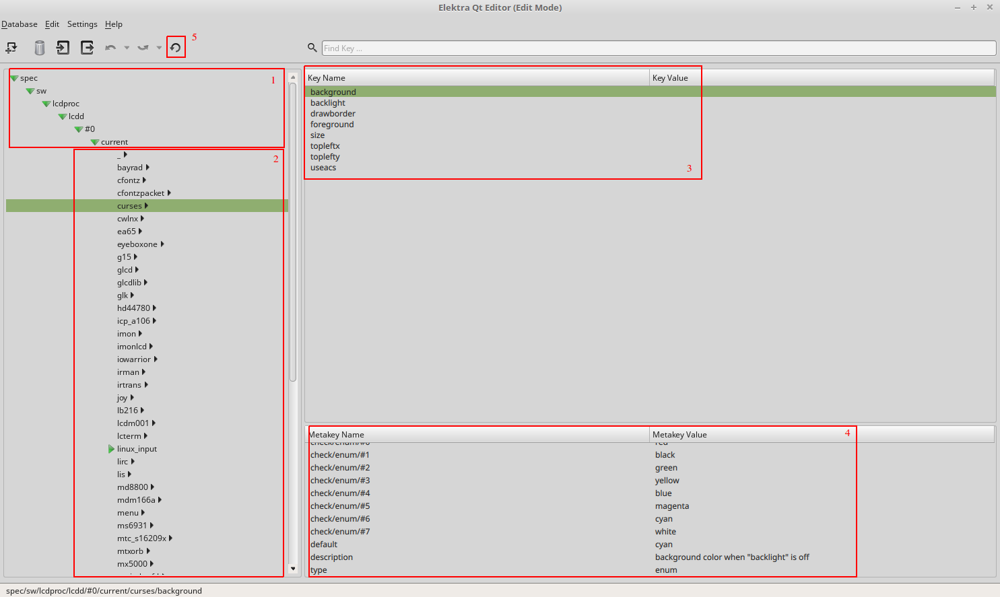
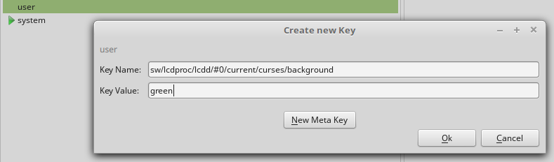

# Using Elektra

In the new version of LCDproc, [Elektra](https://www.libelektra.org/home) 
will be used to store and edit configuration settings which are used by LCDproc.

Elektra stores configuration in a global, hierarchical key database. 
Elektra furthermore provides the possibility to have a 
[validation on configuration settings](https://www.libelektra.org/tutorials/validate-configuration)
because of configuration specifications. A configuration specification 
simply tells which values should be legal for a certain configuration setting,
eg. the server `port` value should be an integer within 0 and 65535.

This tutorial will teach you how change configuration and introspect the specification. 
Be sure to have everything installed correctly by first 
 through [INSTALL.md](INSTALL.md).

## Basic Concept

Elektra stores values in form of a key value pair in a global, 
hierarchical key database. They are saved below a *path* where a path
is similar to linux directories. If you have followed the specification installation process correctly
from the [INSTALL.md](INSTALL.md), you now have the full specification 
[mounted](https://www.libelektra.org/tutorials/mount-configuration-files)
under the `spec` [namespace](https://www.libelektra.org/tutorials/namespaces).
Namespaces are used for [cascading lookups](https://www.libelektra.org/tutorials/cascading)
so the application knows where to search for configuration settings. In case of LCDproc,
the `spec` namespace is first looked at since it contains metadata and afterwards the `user`
namespace which holds the concrete configuration setting values.

You can easily store values with 
`kdb set <key> <value>` and fetch them via `kdb get <key>`.

Let's take the following example:
```sh
kdb set '/sw/lcdproc/lcdd/#0/current/curses/background' green
kdb get '/sw/lcdproc/lcdd/#0/current/curses/background'
> green
```

Elektra's database is hierarchically structured which means that keys are organized 
similar to directories in a file system. In the case
of LCDproc, the relevant keys are located under `/sw/lcdproc/<app>/#0/current`
where `<app>` will either be server configuration `lcdd` or the client configurations
`lcdproc`, `lcdvc` and `lcdexec`. LCDproc drivers are installed on the server, 
so in the upper example we used `lcdd` to change the background 
color of the curses driver to green.
 
The new LCDproc comes with a configuration specification such as [LCDd-spec.ini](server/specification/LCDd-spec.ini)
which is used by Elektra to validate configuration settings. They are located in the respective application subfolders
for [lcdd](server\specification\LCDd-spec.ini), [lcdproc](clients\lcdproc\specification\lcdproc-spec.ini),
[lcdvs](clients\lcdvc\specification\lcdvc-spec.ini), [lcdexec](clients\lcdexec\specification\lcdexec-spec.ini) and
should be mounted as desribed in the INSTALL.md. You can also use `kdb file <key>` ([link to description](https://www.libelektra.org/manpages/kdb-file))
to see where the file is located of a given key.
This guarantees that certain mistakes cannot occur like setting the background color to *greeen* which could
potentially crash the application. 
 
The specification for `/sw/lcdproc/lcdd/#0/current/curses/background` for example
tells us that only `red, black, green, yellow, blue, magenta, cyan, white` are valid and that the value given 
has to be of type string. You will see how to introspect those values in later parts of the tutorial.
Elektra will prevent you to set invalid values which will help reduce errors and misconfiguration.
All these data and much more (eg. default values, descriptions, etc.) are saved as 
[metadata](https://www.libelektra.org/devdocu/metadata)
for each and every key under the `spec` [namespace](https://www.libelektra.org/tutorials/namespaces).
So for the background example above, `spec/sw/lcdproc/lcdd/#0/current/curses/background`
is responsible for holding all metadata.

There are several ways to introspect the specification and change values.
The following four possibilities will be explained in more detail:

* `kdb set`
* `kdb editor`
* `web` gui
* `qt` gui
 
### Kdb Set
 
Using the native command line is the best possibility to find out which configuration settings are available.
If you want to see all available configuration settings for the `server`, you can simply call
```sh
kdb ls '/sw/lcdproc/lcdd/#0/current/server'
#> /sw/lcdproc/lcdd/#0/current/server/autorotate
#> /sw/lcdproc/lcdd/#0/current/server/backlight
#> /sw/lcdproc/lcdd/#0/current/server/bind
#> /sw/lcdproc/lcdd/#0/current/server/driver
...
```
To see all available configuration settings alltogether for `lcdd` you can execute 
`kdb ls '/sw/lcdproc/lcdd/#0/current'`.
To see the current value you can simply call `kdb get` on the respective key.
Now lets take the curses driver for example again and lets see what is the 
current background color is:
```sh
kdb get '/sw/lcdproc/lcdd/#0/current/curses/background'
#> cyan
```
If you want to avoid typing the long path `/sw/lcdproc/lcdd/#0/current` all the time you
can set a bookmark (see `man kdb`).
```sh
kdb set 'user/sw/elektra/kdb/#0/current/bookmarks/lcd' '/sw/lcdproc/lcdd/#0/current'
kdb get +lcd/curses/background
#> cyan
```

The result comes from the set `default` metadata which is saved for the key. If no value is set
by the user, the `default` value is taken.
You can see all metadata by calling `kdb lsmeta`:
```sh
kdb lsmeta '/sw/lcdproc/lcdd/#0/current/curses/background'
#> check/enum/#0
#> check/enum/#1
#> check/enum/#2
#> check/enum/#3
#> check/enum/#4
#> check/enum/#5
#> check/enum/#6
#> check/enum/#7
#> check/type
#> default
#> description
#> type
```
Here we can als see `check/enum/#0-7` which is used by Elektra to assert
for correct configuration settings. You can query for the values by calling
`kdb getmeta`
```sh
kdb getmeta '/sw/lcdproc/lcdd/#0/current/curses/background' 'check/enum/#0'
#> red
```
This `.../#<number>` notation is the typical array notation which is used by Elektra.
If you want to query all metadata and see their values you can use this little script:
```sh
kdb lsmeta '/sw/lcdproc/lcdd/#0/current/curses/background' \
| xargs -I% -n1 sh -c 'printf "% = " && kdb getmeta \
"/sw/lcdproc/lcdd/#0/current/curses/background" "%"'
#> check/enum = #7
#> check/enum/#0 = red
#> check/enum/#1 = black
#> check/enum/#2 = green
#> check/enum/#3 = yellow
#> check/enum/#4 = blue
#> check/enum/#5 = magenta
#> check/enum/#6 = cyan
#> check/enum/#7 = white
#> default = cyan
#> description = background color when "backlight" is off
#> type = string
```
In future versions we might include a command which gives you all metadata 
including their values with a simple command.
If you try to set the value of the background to an invalid value, Elektra
will raise an error and prevent a possible misconfiguration:
```sh
kdb set '/sw/lcdproc/lcdd/#0/current/curses/background' purple
#> Using name user/sw/lcdproc/lcdd/#0/current/curses/background
#> The command kdb set failed while accessing the key database with the info:
#> Sorry, the error (#121) occurred ;(
#> Description: validation failed
#> Reason: Validation of key "user/sw/lcdproc/lcdd/#0/current/curses/background" with string "purple" failed.
#> Ingroup: plugin
#> Module: enum
#> At: <path>/src/plugins/enum/enum.c:218
#> Mountpoint: user/sw/lcdproc/lcdd/#0/current
#> Configfile: <path>/.config/LCDd.conf.17145:1549993505.561040.tmp
```

### Kdb Editor

Another sophisticated possibility to see available options and edit them
is to use the `kdb editor`. If you call `kdb editor <key>`, a local editor will
be opened and all keys under the given `<key>` including all metadata will be shown.

```sh
kdb editor 'spec/sw/lcdproc/lcdd/#0/current/curses/backlight' ni
##Editor
#> []
#>  check/enum/#1 = black
#>  description = background color when "backlight" is off
#>  check/enum/#6 = cyan
#>  check/enum/#5 = magenta
#>  check/enum/#4 = blue
#>  check/enum = #7
#>  default = cyan
#>  check/enum/#7 = white
#>  check/enum/#2 = green
#>  check/enum/#0 = red
#>  check/enum/#3 = yellow
#>  type = string
```
 
As of now the editor is not able to handle multiple namespaces at once so be sure to always use 
the key of the relevant namespace.

If you want to change a value, the best way is to manually set it with `kdb set`. Afterwards
the editor can be used to investigate all associated metadata and change the value afterwards.

```sh
kdb set '/sw/lcdproc/lcdd/#0/current/curses/background' red
kdb editor 'user/sw/lcdproc/lcdd/#0/current/curses/backlight' ni
##Editor
#> = red
#>
#>[]
#> check/enum/#1 = black
#> description = background color when "backlight" is on
#> check/enum/#6 = cyan
#> check/enum/#5 = magenta
#> check/enum/#4 = blue
#> check/enum = #7
#> default = red
#> check/enum/#7 = white
#> check/enum/#2 = green
#> check/enum/#0 = red
#> check/enum/#3 = yellow
#> type = string
```
Not the `user` namespace this time instead of the `spec` namespace from the example before.
If you edit the first line of the editor (` = red`) you can change the actual value which is used by lcdproc.
If you change the value to an invalid one, elektra will tell you after you exit the editor.

### QT Gui

A very convenient way of introspecting the specification is the `Qt` GUI which
is based on a popular cross-platform [framework](https://www.qt.io/). If you have
[installed](https://www.libelektra.org/tools/qt-gui) the necessary dependencies correctly
you can simply call `kdb qt-gui`.

This will open an application for you to see all available keys and their values.



1. You can see all available settings under the spec namespace
In this example we see settings for LCDd
1. This section shows all available drivers. Note the underscore (`_`) at the start which are specifications affecting all drivers.
1. By clicking on any driver, you can investigate all available settings for the concrete driver
1. By clicking on any setting, you can investigate the specification in this window
1. If you change any values, press the `synchronize` button so elektra sees the changes you have made. 

#### Changing a value

The picture above shows all settings for the `spec` namespace. If you want to change a value you have to set
it in the `user` namespace. Right-Click on the `user` namespace on the left side and and press `New` -> `Key ...`.
This will open up a window in which you can set a value as following.



In this example we change the background of the curses driver to green instead of the default cyan. Do not forget to press the `synchronize` button after you have finished your changes.

#### Qt Gui drawbacks

Compared to `kdb set`, the GUI will not provide you with a senseful error message on which
changed values are invalid. So if you use the GUI you should be aware that you have to set
correct values or use the command line to see what actually is wrong.